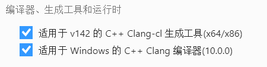
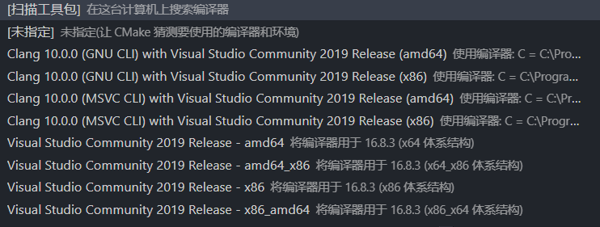
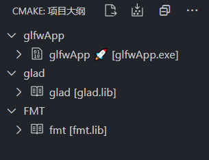
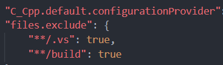
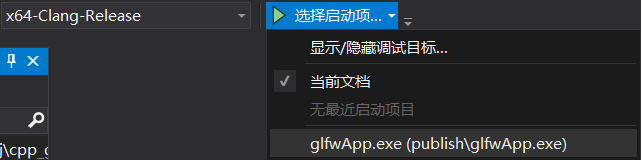
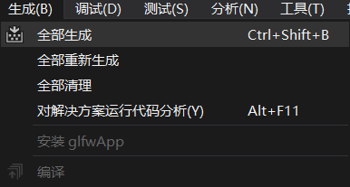
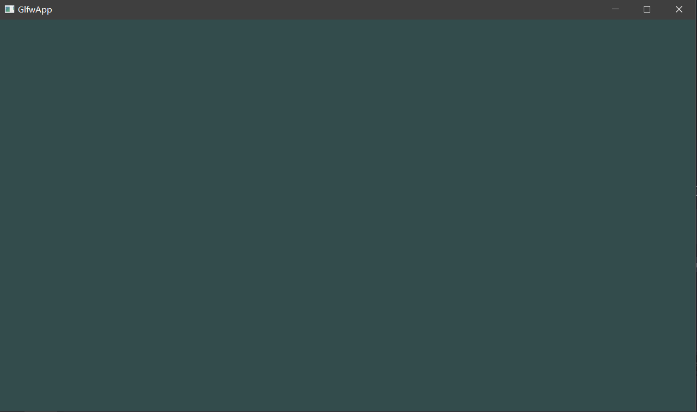

# GlfwApp 

**GlfwApp**是一个基于OpenGl，C++17，CMake的glfw空项目。

该项目基于**Windows10 x64**

## 该项目支持的编译器
- **Clang**（需要支持C++17，作者用的是10.0版本）

也许支持MinGw和MSVC编译器，但是尚未测试。

# 如何编译项目（Windows 10）

## Visual Studio 2019

我们首先需要安装**Visual Studio 2019**并勾选以下工作负载

你可以从[CMake官网](https://cmake.org/download/)下载**CMake**

也可以勾选CMake工具

## Ninja

我们还需要用到一个生成器：[Ninja](https://github.com/ninja-build/ninja/releases/)

下载Ninja后，将`ninja.exe`复制到CMake安装目录/bin中：

打开命令提示符，输入`ninja`,如果显示

    ninja: error: loading 'build.ninja': 

说明ninja配置成功！

# 使用Visual Studio Code开发项目。（推荐）

为了支持**Visual Studio Code**中的CMake，你需要安装以下扩展：

- CMake
- CMake Tools
- C/C++

并通过CMake官网独立安装CMake。

**通过Code**打开`根目录`

## 使用Visual Studio Code编译

根目录中右键**通过Vs Code打开**。

这时，CMake Tools会读取**CMakeLists.txt**并弹出以下选项：

如果没有显示出编译器，请点击**扫描工具包**。

然后选择`Clang 10.0.0(MSVC CLI) with Visual Studio Community 2019 Release`(版本可能会有出入)。

如果选择`x86`版本，会显示
    
    lld-link: error: undefined symbol: ...

因为该项目使用x64版本的第三方库，请正确选择编译器。

选择工具包成功后，会在下面状态栏中显示

在状态栏上点击左边的**CMake:[Debug]:就绪**,然后将Debug改为**RelWithDebInfo**。

Vscode会开始生成CMake缓存，如果生成成功，会在**输出**窗口弹出

    Configuring done
    Generating done
    Build files have been written to: rootFolder/build

注意：`rootFolder`是项目的根目录

点击CMake图标，如果你看到类似于下面的CMAKE:项目大纲，说明缓存生成成功了！

点击右上角小图标**生成所有项目**

**生成**将持续5-10秒，直到**输出**面板显示以下输出：

    生成已完成，退出代码为 0

说明编译成功了！

## 为什么没有显示Build文件夹？
当你用Vscode打开文件夹，你会发现资源管理器中的`build`文件夹不见了，原因：

为了方便开发者开发项目，我将Build文件夹忽略，如果想要恢复，找到`.vscode`文件夹，打开[settings.json](.vscode/settings.json)
找到`files.exclude`,去除`"**/build": ture`选项。不要忘记将前面的逗号去掉！

## 生成CMake缓存
可以通过保存**CMakeLists.txt**快捷生成缓存。

另一种推荐做法，可以通过右键**CMakeLists.txt**，选择**清理所有项目并生成缓存**。这样可以删除原来的缓存，减少BUG。

## 如何调试项目
找到任务栏的小甲虫，点击即可，不要忘记首先**生成CMake缓存**！

# 使用Visual Studio 2019开发项目。

右键根目录，单击**使用Visual Studio打开**。

## 生成CMake缓存
可以通过保存**CMakeLists.txt**快捷生成缓存。

还可以通过右键**CMakeLists.txt**，选择**为glfwApp生成缓存**。

## 如何调试项目
在上方找到**选择启动项**，打开下拉菜单，选择`glfwApp(publish/glfwApp.exe`。

## 使用Visual Studio 2019编译

使用Visual Studio 2019（以下简称vs2019） 打开项目的根目录。

vs2019会根据`CMakeSettings.json`生成`x64-Clang-Release`配置。
然后vs2019会自动生成CMake缓存。

持续数秒后，输出面板将显示：

    1> 已提取 CMake 变量。
    1> 已提取源文件和标头。
    1> 已提取代码模型。
    1> 已提取包含路径。
    1> CMake 生成完毕。

说明CMake缓存生成成功！

找到任务栏的**生成-全部生成**，或者按**Ctrl+Shift+B**

编译将持续数秒，当输出面板显示：

    全部生成 已成功。

说明项目编译成功！

## 运行程序
编译完成后，找到`rootFolder/build/publish/glfwApp.exe`,双击运行，你将会看到一个无聊的黑色窗口。

# 项目使用方式
下面我将介绍如何使用这个空项目：

## 第三方库

### 该项目已经安装好部分第三方库，帮助开发者开发项目：

- GLFW
- glad
- fmt
- rapidjson

### 添加第三方库
推荐将第三方库安装在`rootFolder/deps`文件夹，至于如何写入**CMakeLists.txt**，这里不详细讲。

## 添加源代码(.c/.cpp)
请将源代码添加到`rootFolder/src`文件夹，你可以在src文件夹创建很多子目录，不会影响编译。

CMake会添加`rootFolder/src`文件夹及其所有子目录的源文件。

## 添加资源文件(.rc)
请将资源文件添加到`rootFolder/src`文件夹。

## 头文件(.h/.hpp)
请将头文件添加到`rootFolder/src`文件夹，或者子目录，不管你将文件放在哪里，都可以直接`#include "Filename.h"`,前提是头文件不能重名。

# 协议 - MIT

## 联系方式

- **email**: 2412796872@qq.com

